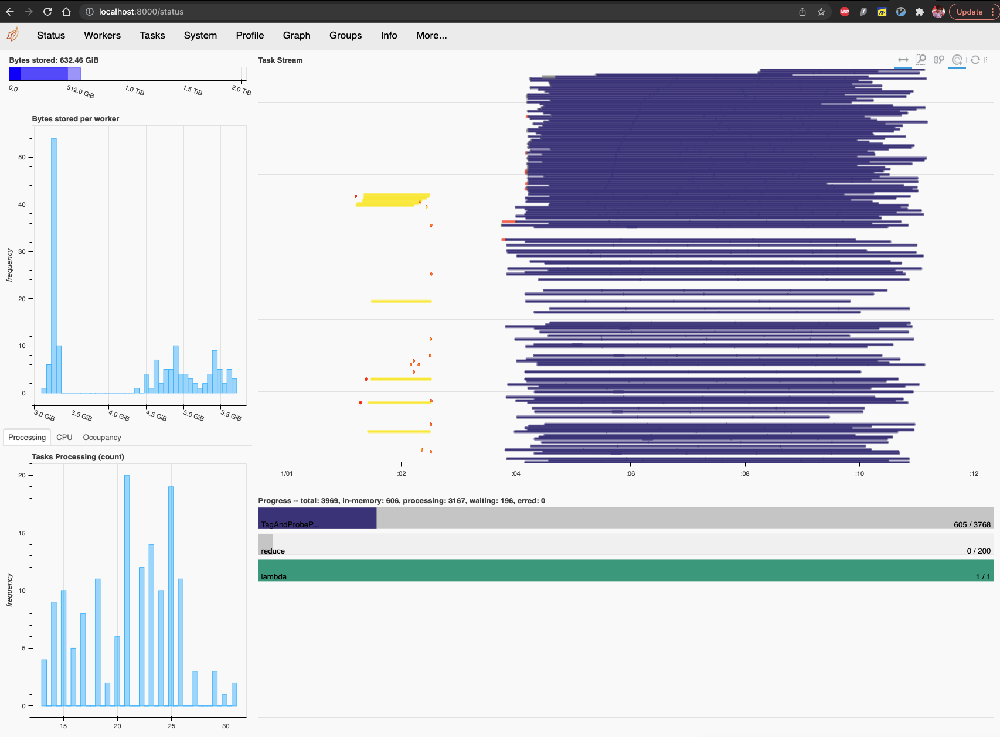

Workload Distribution
=====================

In this section we describe the main ways in which it is possible to distribute workload on job scheduling systems.

Working with Dask
-----------------

`Dask <https://dask.org/>`_ is one of the most modern infrastructures providing performance at scale: it is fully written in Python and interfaces nicely to job queuing systems used in HEP such as `HTCondor <http://jobqueue.dask.org/en/latest/generated/dask_jobqueue.HTCondorCluster.html>`_ and `SLURM <http://jobqueue.dask.org/en/latest/generated/dask_jobqueue.SLURMCluster.html>`_.

Since it could be difficult to use at first, here we try to summarize the main troubles one could face and some tips to get the most out of this tool.

Troubleshooting
~~~~~~~~~~~~~~~

Here is a collection of known possible issues that could arise when working with Dask:

KilledWorker
""""""""""""

   The reason why this happens is explained clearly in `this answer <https://stackoverflow.com/questions/46691675/what-do-killedworker-exceptions-mean-in-dask>`_. When this happens, it's a good idea to run the analysis flow in iterative mode and a single file: in this way the real error can be seen and fixed. If this doesn't produce any error, than the job might be using too much memory and you have to increase it.

Connect to the Dashboard
~~~~~~~~~~~~~~~~~~~~~~~~

One of the nicest features of Dask consists in the possibility of monitoring the job submission through the `dashboard <https://docs.dask.org/en/stable/diagnostics-distributed.html#dashboard>`_.

If you work on a remote cluster (so pretty much all the time) you can see the dashboard in the following way:

#. Find the remote port on the remote cluster

   The Dask cluster you're running remotely has the dashboard by default connected to port **8787**. If this is not available, Dask will notify it when starting the cluster, like in this case:

   .. image:: images/dask_port.png

#. SSH port forwarding

   In order to be able to see the dashboard on your local browser, you need to connect to the remote port. Assuming that **8000** will be your **local port** and **8787** is the dashboard one (i.e., the one you got in the previous step), run the following:

   .. code-block:: bash

        ssh -Y -N -f -L localhost:8000:remote_address:41993 username@remote_address

   where clearly ``remote_address`` and ``username`` have to be changes accordingly.

#. Open dashboard

   In your browser, go to the following address:

   .. code-block:: bash

        http://localhost:8000/status

LXPLUS Vanilla Submitter
------------------------

In order to provide an alternative to Dask to work on LXPLUS, a vanilla submitter was implemented. Being very basic and a temporary solution until Dask is mature, the distribution model is quite simple and one ROOT file is assigned to each job. 

A directory called ``.higgs_dna_vanilla_lxplus`` is created in the current path, with a subdirectory with the name of the ``json-analysis``, with a data-time suffix of the form ``YMD_HMS``. This suffix is used to avoid overwriting previous submissions. There, two subdirectories called ``input`` and ``jobs`` are created: the former contains the new JSON files split by ROOT file, while the latter contains the submit files that are passed to ``condor_submit``. 

By default all jobs (files) for a given sample are submitted to the same cluster. You can change this behaviour by setting ``cluster_per_sample=False`` in the ``LXPlusVanillaSubmitter`` class constructor. In this case, each job will be submitted to a separate cluster. 

An example of command line is the following:

.. code-block:: bash

     run_analysis.py --json-analysis /afs/cern.ch/work/g/gallim/devel/HiggsDNA/analyses/json_analysis_file_example.json --dump /afs/cern.ch/work/g/gallim/devel/vanilla_lxplus_tests --skipCQR --executor vanilla_lxplus --queue espresso 
      
the arguments ``--queue`` and ``--memory`` are the same used also for ``dask/lxplus``.

.. warning::
   
      When working from ``eos``, specific care has to be taken in order correctly fetch log and error files. As explained `here <https://batchdocs.web.cern.ch/troubleshooting/eos.html#no-eos-submission-allowed>`_ one can run:

      .. code-block:: bash

         condor_transfer_data $USERNAME
         condor_rm $USERNAME -constraint 'JobStatus == 4' || true

      to fetch logs and error files and then remove the finished jobs that otherwise would be kept showing when running ``condor_q``.

.. note::
   As already stated above, this submitter is just a temporary solution and it is not meant to be complete nor maximally efficient. 
   
   A smarter solution would have to be implemented as an executor directly in Coffea, and it is on the to-do list.
